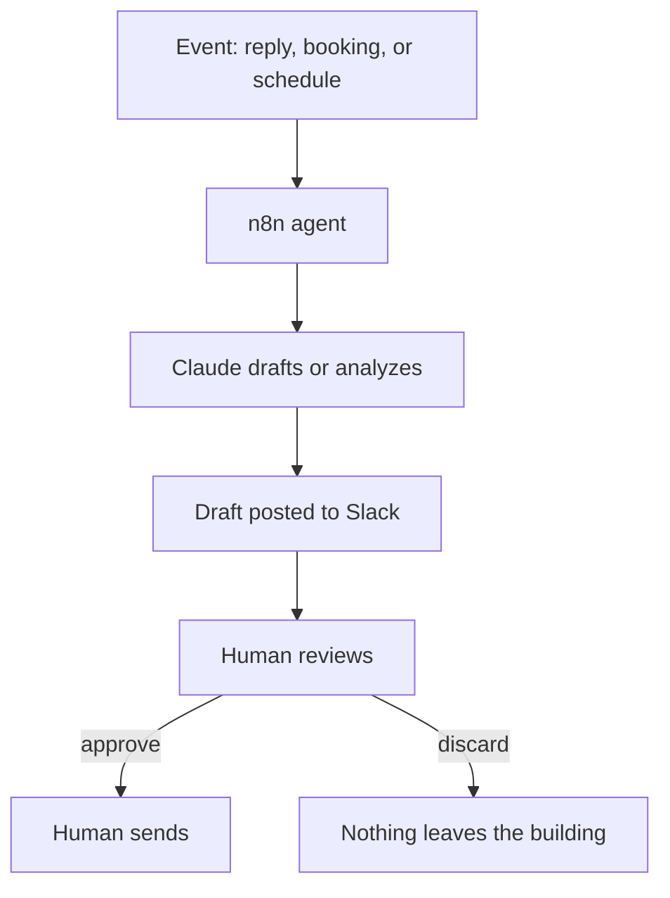

# Internal Ops Automation Platform

A self hosted automation platform running a suite of internal agents that take repetitive operations work off a small team, built on one firm rule: AI drafts, humans send.

> **Status:** Platform live in production. Agents built and rolling out. This documents the platform design and the principles, not the workflows or any infrastructure detail.

## The problem

A small team drowns in repeatable operations: drafting replies, prepping for calls, recovering no shows, watching the numbers. Hiring for it is slow and expensive. Off the shelf SaaS does pieces but not the whole, and not with our context.

## The approach

A self hosted n8n instance running a set of focused agents, each owning one job. A few that are safe to describe:

- **Funnel diagnostic dashboard.** Pulls the operational numbers into one daily readout so the team sees the real chokepoint instead of guessing.
- **Reply drafters.** When a customer replies, an agent drafts a suggested response into Slack. A human reads it and sends it. The agent never sends.
- **Call prep.** Before a call, an agent assembles the context the rep needs.
- **No show recovery.** Structured follow up when a booked call does not happen.

## The one rule that shapes everything

**No AI ever messages a customer automatically.** Every AI drafted reply lands in Slack for a human to approve and send. This is a deliberate constraint, not a limitation. It keeps a person accountable for anything a customer reads, and it means a bad generation is a discarded draft, never a sent message.

## Reliability

This runs the business, so it is built to stay up.

- Moved off a fragile single file database onto Postgres in a containerized stack.
- A reverse proxy terminates TLS so the instance is reachable securely.
- Nightly automated backups, with an off server copy.
- Pinned versions so an unattended update cannot break a live workflow.

Infrastructure specifics, addresses, and secrets are intentionally omitted.

## What this demonstrates

- Human in the loop AI by design, with a clear accountability boundary.
- Owning the full stack: not just building workflows but running the platform they live on reliably.
- Decomposing messy operations into single responsibility agents.

## Scope and what is omitted

No workflow exports, no server addresses, no credentials, and nothing tied to outreach tactics. Platform design and principles only.

## About

Built by Luke Fitzgibbon, co-founder of Close Concierge. I build automation that gives a small team leverage and is reliable enough to run a real business.

- Website: [thecloseconcierge.com](https://thecloseconcierge.com)
- More work: [github.com/fitzoutreach](https://github.com/fitzoutreach)
